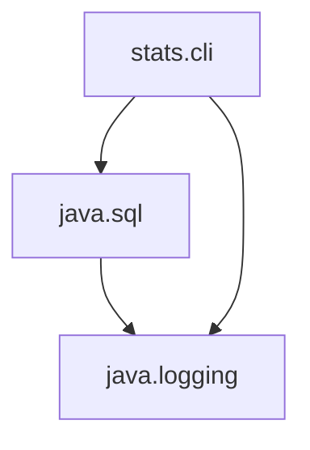

# Introduction to Modular Development

## Modular development starts in a modular platform

```
$ java --list-modules
```


```
$ java --list-modules java.base
```
## JLink

To link a set of modules and generate a runtime image


```
$ jlink --module-path jmods/ --add-modules java.desktop --output myimage
```


```
$ java -jar myimage/bin/java somejarfile.jar
```


## Introduction to modules

- Requires a name
- The code is organized on packages
- The module self description is in a source file `module-info.java`
- Everything depends on `java.base`

```java
module stats.core {
    requires guava;
}
```

## Example


to fix this

```java
module java.sql {
    requires transitive java.logging;
}
```

This means anyone depending on java.sql can import java.logging


## Accesibility

```java
modules stats.core {
    exports ....
}
```

```java
public != accesible
```
